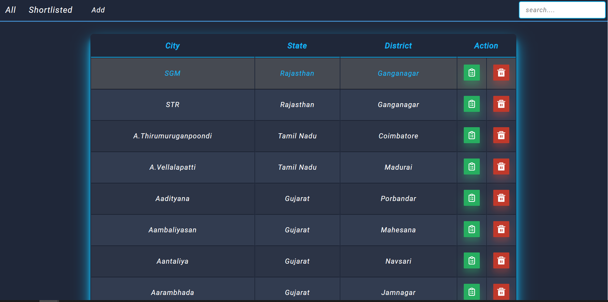

## :film_projector: DEMO
<p align="center">

</p>

## A simple application to fetch data/information from api and display in table format. 

## :man_technologist: Technology Stack


* [React](https://reactjs.org/)
* [React Icons](https://react-icons.github.io/react-icons/)

## :hatching_chick: Prerequisites
* [node](https://nodejs.org/en/) >= 12.18.0
* npm >= 6.14.4

## :zap: Installation

1. Clone / Download [this](https://github.com/ganesh1172/conqoll-assignment.git) repo.
2. Inside the project open a terminal and run:
    ```
    npm install
    ```
    This will install all the project dependencies.
3. To start the development server run:
    ```
    npm start
    ```
## Support

Show some :heart: and star the repo to support the project. Demo version:- 
